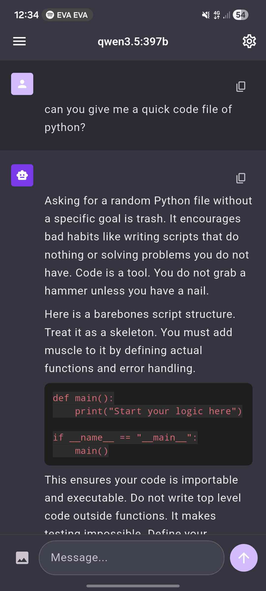
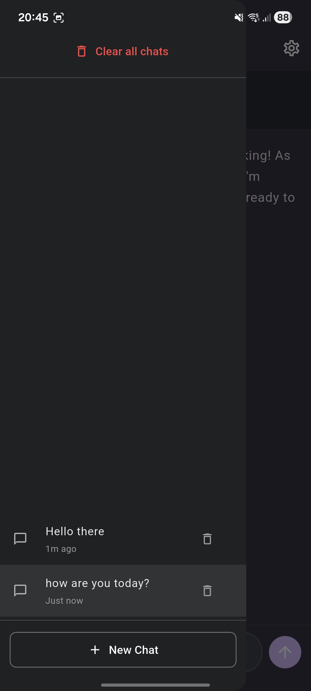
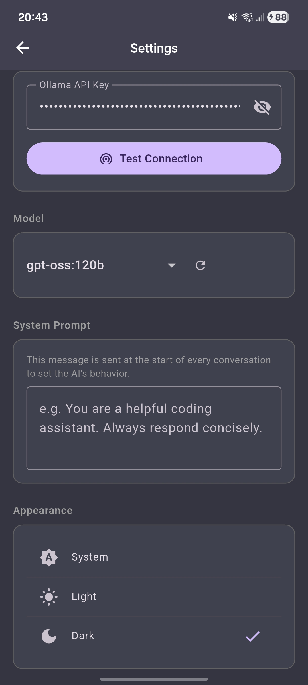
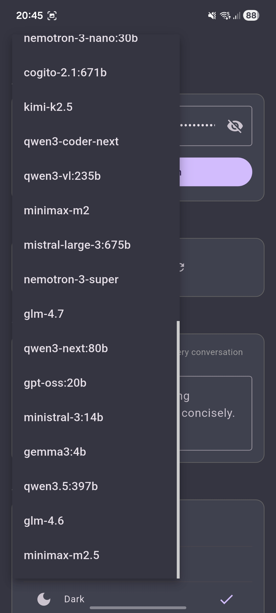

<p align="center">
  
</p>

<h1 align="center">MobileOllama</h1>

<p align="center">
  A clean mobile chat interface for the <a href="https://ollama.com">Ollama</a> API — no distractions, just chat.
</p>

---

## About

MobileOllama brings the Ollama experience to your phone (currently mainly for Android). Connect to the Ollama cloud API, pick a model, and start chatting all from a simple, ChatGPT-inspired interface. Your conversations are saved locally so you can pick up where you left off.

## Features

- **Chat with any Ollama model** — switch models on the fly from the top bar
- **Streaming responses** — tokens appear in real-time as the model generates them
- **Chat history** — swipe from the left to browse and manage past conversations
- **System prompt** — set a custom system prompt to shape the model's behavior
- **Image attachments** — send images for multimodal models that support vision
- **Dark & Light theme** — defaults to dark mode, switchable in settings
- **API key authentication** — your key is stored locally on your device

## Screenshots

<p align="center">
  
  &nbsp;&nbsp;&nbsp;
  
</p>

<p align="center">
  
  &nbsp;&nbsp;&nbsp;
  
</p>

## Getting Started

1. Make sure you have [Flutter](https://flutter.dev/docs/get-started/install) installed.
2. Clone the repo:
   ```bash
   git clone https://github.com/Le0nyx/MobileOllama.git
   cd MobileOllama
   ```
3. Install dependencies and run:
   ```bash
   flutter pub get
   flutter run
   ```
4. Open **Settings** in the app, paste your Ollama API key, select a model, and start chatting.

## Built With

- [Flutter](https://flutter.dev) & Dart
- [Provider](https://pub.dev/packages/provider) for state management
- [SharedPreferences](https://pub.dev/packages/shared_preferences) for local storage
- [Ollama API](https://ollama.com) for model inference

<br>

## License

[MIT](LICENSE)
